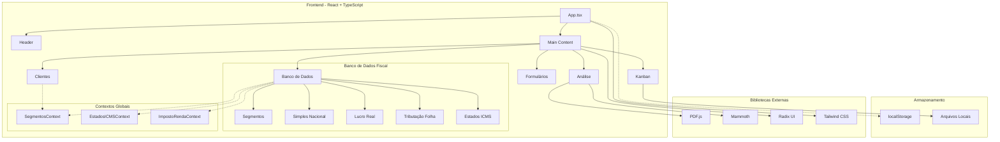
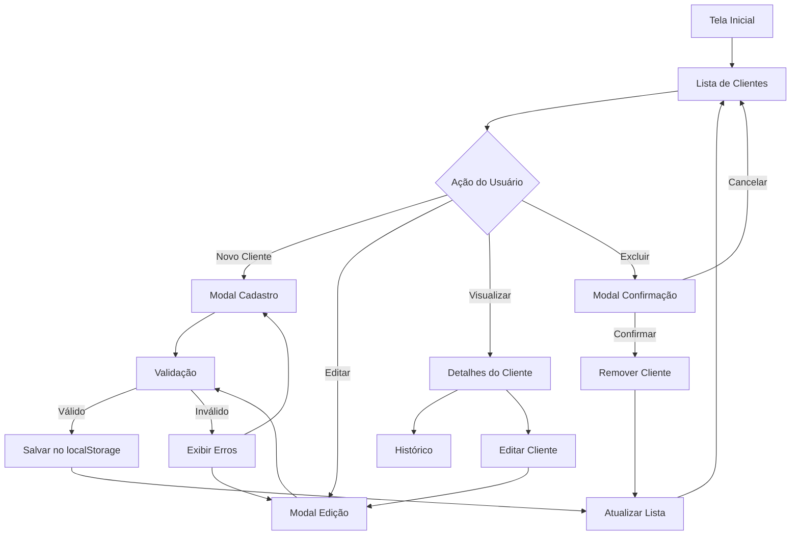
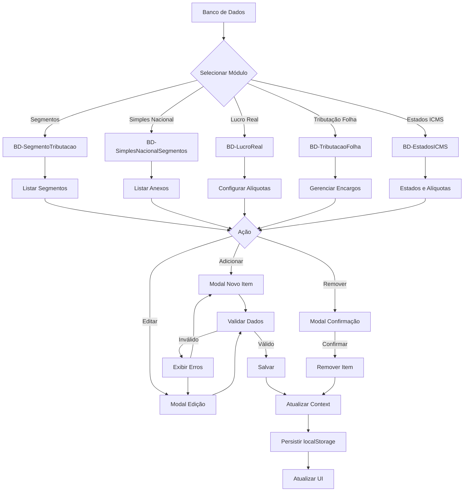
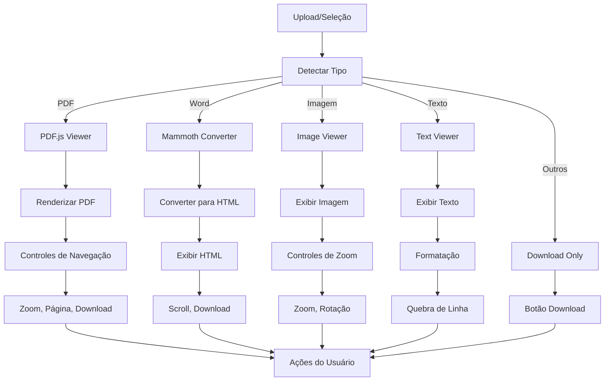
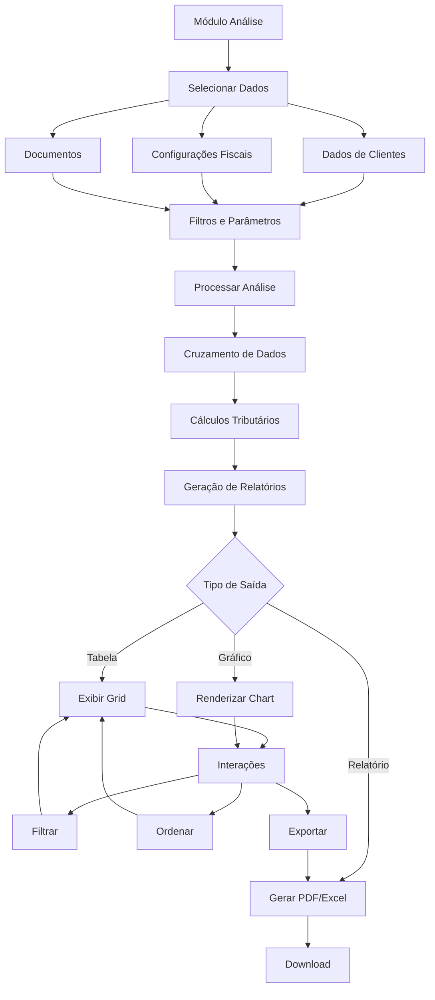

# Contexto e Arquitetura
# Fiscal Pro

## 🏛️ Arquitetura Macro



## 🔄 Fluxo de Telas Principais

### 1. Fluxo de Gestão de Clientes



### 2. Fluxo de Configuração Fiscal



### 3. Fluxo de Visualização de Documentos



### 4. Fluxo de Análise de Dados



## 🗂️ Estrutura de Dados

### Modelo de Cliente
```typescript
interface Cliente {
  id: string;
  nome: string;
  email: string;
  telefone: string;
  empresa?: string;
  cnpj?: string;
  status: 'ativo' | 'inativo' | 'lead';
  dataUltimaInteracao: Date;
  observacoes?: string;
  historico: HistoricoItem[];
}
```

### Modelo de Segmento Tributário
```typescript
interface SegmentoTributacao {
  id: string;
  descricao: string;
  aliquota: number;
  tipo: 'simples' | 'lucroReal' | 'lucroPresumido';
  ativo: boolean;
  dataAtualizacao: Date;
}
```

### Modelo de Estado ICMS
```typescript
interface EstadoICMS {
  uf: string;
  nome: string;
  aliquotaInterna: number;
  aliquotaInterestadual: number;
  observacoes?: string;
}
```

## 🔧 Padrões de Desenvolvimento

### Estrutura de Componentes